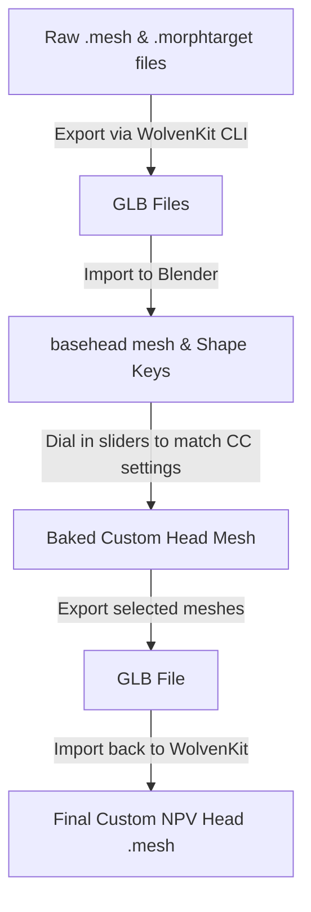
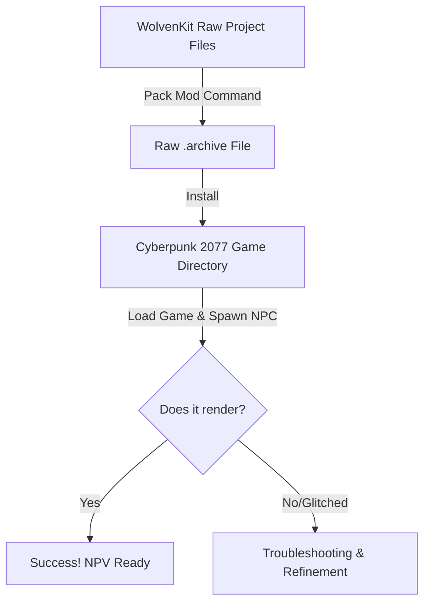

# Cyberpunk 2077 NPV (Non-Player V) Creation Guide
*An Exhaustive Technical Reference and Walkthrough for Creating Spawnable Custom NPC Versions of Player V*

---

## 1. Introduction and Core Concepts

In the *Cyberpunk 2077* modding landscape, an **NPV (Non-Player V)** refers to a standalone, custom Non-Player Character (NPC) that visually replicates a player's custom **V** character. Because of the architectural division in the REDengine 4 between the player character (which is dynamically generated and driven by a Character Creation save block) and standard NPCs (which rely on static, compiled configurations), spawning "yourself" in the game world is not a native feature. 

### Why Create an NPV?
1. **Virtual Photography**: Virtual photographers extensively use NPVs to pose their custom V characters alongside other key NPCs (like Panam, Judy, Kerry, or River) in dynamic lighting environments.
2. **Custom Companions**: Through scripting mods like **Appearance Menu Mod (AMM)**, NPVs can be registered as followers/companions that travel, fight, and ride in vehicles with the player.
3. **Immersive Roleplay**: Creators can place their own V variants in Night City as background NPCs, shopkeepers, or gang members.

### Technical Architecture
The engine handles the player character differently from NPCs in several ways:

| Aspect | Player character (V) | Standard NPC / NPV |
| :--- | :--- | :--- |
| **Mesh Rendering** | Uses a malleable base head mesh and applies runtime `.morphtarget` shape deformations based on save file parameters. | Uses a defined mesh set loaded from static character entities (`.ent`) and appearance (`.app`) libraries. |
| **File Structure** | Driven by dynamic component structures in the `Player` template files. | Structured in logical character hierarchies (`base\characters\entities\`). |
| **Skeletal Rigging** | Rigged strictly to `pwa` (Player Woman Average) or `pma` (Player Man Average) rigs. | Can use custom, heavy, big, or specialized NPC rigs (e.g., Royce, Sasquatch, Adam Smasher). |

To bridge this gap, NPV modding involves exporting V's face shape (either baking it into a static mesh in Blender or programmatically injecting the morph targets and weights into an NPC entity configuration) and packaging it into a standard NPC asset archive that can be spawned using mods like AMM.

---

## 2. Prerequisites & Tool Setup

Before embarking on NPV creation, you must install and configure the following developer utilities:

1. **WolvenKit**: The primary open-source Integrated Development Environment (IDE) for modding Cyberpunk 2077 and Witcher 3. It allows you to search the game's uncooked archive files, modify entities, edit appearance files, and pack the final `.archive`. 
   * *Download*: [REDmodding WolvenKit Releases](https://wolvenkit.redmodding.org/)
2. **Blender (v3.6 or v4.x)**: The 3D modeling and sculpting software used to shape V's face, adjust eye clipping, align teeth, and customize meshes.
3. **WolvenKit Blender IO Suite**: An essential Blender add-on that enables the seamless import and export of REDengine's customized GLTF/GLB formats, preserving armature bindings, rigs, and vertex weights.
   * *Download*: [WolvenKit Blender IO Suite GitHub](https://github.com/WolvenKit/WolvenKit-Blender-IO-Suite)
4. **Cyber Engine Tweaks (CET)**: The framework that unlocks the in-game developer console and supports LUA scripting plugins.
   * *Download*: [Cyber Engine Tweaks on Nexus Mods](https://www.nexusmods.com/cyberpunk2077/mods/107)
5. **Appearance Menu Mod (AMM)**: An advanced CET plugin that allows in-game asset spawning, companion control, posing, and appearance swapping. AMM reads external LUA registrations to recognize custom NPCs.
   * *Download*: [Appearance Menu Mod on Nexus Mods](https://www.nexusmods.com/cyberpunk2077/mods/790)
6. **NPV Example Project Template**: A boilerplate WolvenKit template project that contains the pre-configured `.ent` and `.app` file structures. Using a template is highly recommended to avoid structural syntax errors that crash the game.
   * *Download*: Found on the [REDmodding Wiki](https://wiki.redmodding.org/cyberpunk-2077-modding/modding-guides/npcs/npv-v-as-custom-npc) or Nexus Mods.

---

## 3. Step 1: Extracting and Documenting V's Customization Settings

V's appearance in Cyberpunk 2077 is saved inside the save file (`sav.dat`) as a series of numerical IDs within the **Character Creation (CC) Block**. To recreate this appearance, you must extract these values.

### Method A: Manual Documentation (In-Game)
1. Load your save game in-game.
2. Visit a mirror in your apartment or go to any Ripperdoc.
3. If using the **Appearance Change Unlocker** mod, open the customization menu.
4. Record the precise slider numbers for every feature:
   * *Rig Selection*: Female (`pwa`) or Male (`pma`)
   * *Face*: Eye shape, Nose shape, Mouth shape, Jaw shape, Ears shape.
   * *Hair*: Hair Style ID and Hair Color ID.
   * *Skin*: Skin Tone ID.
   * *Extra Features*: Eyebrows, Cyberware, Makeup (Eyeliner, Eyeshadow, Lipstick), Scars, Tattoos, Piercings.

### Method B: Save Parsing (Automated/Developer)
For advanced modders or automation developers, you can extract this block directly from the save binary.
1. Locate your save folder: `%USERPROFILE%\Saved Games\CD Projekt Red\Cyberpunk 2077\`.
2. Parse the `sav.dat` file using a library like **CyberCAT** or Python save-parsing hacks (e.g., `CyberpunkPythonHacks`).
3. Extract the CC block to emit a `cc_settings.json` file. This contains the exact morph values and asset IDs without needing to load the game.

### NoraLee's NPV Part Picker
Once you have the numerical customization parameters, you need to map them to real game asset paths.
1. Access the **NPV Part Picker** web utility.
2. Select your body gender (`pwa` or `pma`) and input the slider values you recorded.
3. The tool generates a list of files that correspond to your V, including:
   * The base head mesh (`.mesh`).
   * The `.morphtarget` files for the eyes, nose, mouth, jaw, and ears.
   * The hair mesh, skin material instance (`.mi`), and texture maps.

---

## 4. Step 2: Preparing and Sculpting the Head Mesh in Blender

Cyberpunk 2077 uses a "malleable" base head mesh. When you choose face options in the character creator, the engine deforms this base head by applying morph weights to various `.morphtarget` files. For your NPV to have your exact face shape, you must apply these morphs in Blender.



### 1. File Exporting
1. In WolvenKit, search the Asset Browser for the base head mesh files corresponding to your V's rig:
   * *Female V (`pwa`)*: `h0_000_pwa_c__basehead.mesh`
   * *Male V (`pma`)*: `h0_000_pma_c__basehead.mesh`
2. Add the base head mesh and the associated facial `.morphtarget` files (like `eyes_02.morphtarget`, `nose_05.morphtarget`) to your project.
3. Go to the **Import/Export Tool** in WolvenKit and export them as `.glb` files.

### 2. Blender Import & Morphing
1. Open Blender. Ensure the **WolvenKit Blender IO Suite** add-on is active.
2. Open the custom `head_import.blend` template file included with the NPV template project.
3. Go to `File > Import > Cyberpunk GLTF` and import your exported GLB meshes.
4. Select the head mesh and navigate to the **Shape Keys** panel (Properties Editor > Data tab).
5. Locate the shape keys corresponding to your face shape IDs (e.g., `eyes_shape_02`, `nose_shape_05`).
6. Dial the slider values of your selected shape keys to `1.0`. Set all other shape keys to `0.0`.
7. Once your head mesh matches your V's face shape, you must "bake" the shape keys:
   * Click the drop-down arrow in the Shape Keys panel and select **New Shape From Mix**.
   * Delete all other shape keys, leaving only the newly created mixed shape.
   * Set the mixed shape's value to `1.0` and select **Apply Selected Shapekey to Basis**.

### 3. Sculpting and Troubleshooting
> [!WARNING]
> **Common Visual Glitches**
> * **"Pupil/Eye Clipping"**: When the head shape changes, the eyeballs may clip through the eyelids. To fix this, export the eye meshes (`base\characters\eyes\...`) and import them into your Blender scene. Use Blender's **Grab Tool** or **Sculpt Mode** to manually reposition the eyelids or shift the eyes slightly to align them perfectly.
> * **"Floating Hair/Seams"**: The hair mesh might not rest properly on a custom-sculpted head. Use the **Surface Deform** modifier in Blender to mold the hair cap mesh to match the contours of your custom head.

### 4. File Re-importing
1. Select your finished head mesh in Blender.
2. Go to `File > Export > Cyberpunk GLB` and export the file.
3. In WolvenKit, use the **Import/Export Tool** to import the GLB back into your project, replacing the original uncooked `.mesh` file.

---

## 5. Step 3: Programmatic Morph Blending (Alternative to Blender)

For advanced technical setups (and automated generators), exporting meshes to Blender can be skipped entirely. The REDengine is capable of blending morph targets at runtime for NPCs, provided the files are structured correctly.

Instead of baking the face mesh, you can programmatically inject the **morph weights** directly into the `.app` or `.ent` files' JSON representations.

### The JSON Morph Structure
In the `.app` file's JSON, morphs are applied to a component via the `morphs` array. Each entry contains a reference to the morphtarget path and a scale weight:

```json
{
  "$type": "entMorphTargetSkinSkinControllerComponent",
  "name": "head_morph_controller",
  "morphs": [
    {
      "morphtarget": {
        "DepotPath": "base\\characters\\head\\player_base_heads\\player_female_average\\morphtargets\\eyes_02.morphtarget",
        "Flags": "Default"
      },
      "region": "eyes",
      "targetName": "eye_shape_02",
      "weight": 1.0
    },
    {
      "morphtarget": {
        "DepotPath": "base\\characters\\head\\player_base_heads\\player_female_average\\morphtargets\\nose_05.morphtarget",
        "Flags": "Default"
      },
      "region": "nose",
      "targetName": "nose_shape_05",
      "weight": 1.0
    }
  ]
}
```

> [!TIP]
> **Runtime Blending Benefits**
> Using runtime blending dramatically reduces file sizes. Instead of carrying heavy, unique `.mesh` assets inside the `.archive` file, the mod package only contains path references and floats, leveraging the game's existing assets.

---

## 6. Step 4: Structuring the WolvenKit Project

A valid NPV mod package requires a specific, rigid directory structure to ensure that files load in the correct order and don't collide with other players' NPV mods.

### 1. Folder Structure Layout
Create the following hierarchy in your WolvenKit project's raw source folder:

```
YourProjectFolder/
├── source/
│   ├── archive/
│   │   └── pc/
│   │       └── mod/
│   │           ├── [modder_prefix]_[npv_name].archive
│   │           └── [modder_prefix]_[npv_name].archive.xl (optional)
│   └── bin/
│       └── x64/
│           └── plugins/
│               └── cyber_engine_tweaks/
│                   └── mods/
│                       └── AppearanceMenuMod/
│                           └── Collabs/
│                               └── Custom Entities/
│                                   └── [modder_prefix]_[npv_name].lua
```

### 2. Scoping and Naming Conventions
To prevent game crashes and load conflicts, you **MUST** prefix all custom files and internal resource paths with a unique identifier (e.g., your username and your V's name):

> [!IMPORTANT]
> Use `base\moddername\charactername\` as your folder root. Never overwrite the base game files directly (e.g., do not save your custom head mesh as `base\characters\head\...\h0_000_pwa_c__basehead.mesh` as this will change the head shape of ALL female characters in the game).

* **Correct Path**: `base\nora_lee\jane_v\jane_v_head.mesh`
* **Incorrect Path**: `base\characters\head\h0_000_pwa_c__basehead.mesh`

### 3. Modifying Entity (`.ent`) & Appearance (`.app`) Files
The `.ent` (entity) file acts as the blueprint for the character. It points to the `.app` (appearance) file, which houses the individual visual components.

1. **Root Entity Configuration (`.ent`)**:
   * Open the custom `.ent` file in WolvenKit.
   * Locate the `appearances` array.
   * Update the `appearanceName` to your desired label (e.g., `default`).
   * Set the `app` path property to point to your custom `.app` file path (e.g., `base\nora_lee\jane_v\jane_v.app`).

2. **Appearance File Configuration (`.app`)**:
   * Open the custom `.app` file in WolvenKit.
   * Locate the `appearances` table.
   * Under the `partsValues` or `components` array, define your character's body, head, hair, skin, and clothing components.
   * Swapping assets involves updating the `DepotPath` in the mesh component nodes:
     * *Head Component*: Set `mesh` `DepotPath` to `base\nora_lee\jane_v\jane_v_head.mesh`.
     * *Hair Component*: Set `mesh` `DepotPath` to the player hair mesh (e.g., `base\characters\hair\player_hair\hair_07.mesh`).
     * *Skin Material*: Set the material instance to point to the correct skin tone instance (e.g., `base\characters\skin\skin_light_01.mi`).
   * **Component Cleanup**: Delete all unused components. If the `.app` file retains default clothing or accessory slots that lack linked models, the game engine will waste memory or crash when rendering the character. Use WolvenKit's **File Validation** to identify and wipe clean these dead nodes.

---

## 7. Step 5: Configuring Appearance Menu Mod (AMM) Integration

To spawn your NPV in the game world using AMM, you must register it with a CET LUA script. AMM scans its `Collabs/Custom Entities` directory on game boot and loads any LUA files it finds.

### Lua File Structure
Create a LUA file named `[modder_prefix]_[npv_name].lua` and place it in the CET path. Populate it with the following structure:

```lua
-- AMM custom NPV Registration Script
return {
    -- The name of the creator (shows in AMM info)
    modder = "NoraLee",
    
    -- A completely unique ID (alphanumeric, no spaces or symbols)
    unique_identifier = "noralee_jane_v_npv",
    
    -- The internal registry name displayed in the AMM Spawn Menu dropdown
    name = "Jane V",
    
    -- The skeletal rig information (pwa = female base, pma = male base)
    rig = "pwa",
    
    -- The relative paths to the root entity file
    entity_info = {
        path = "base\\nora_lee\\jane_v\\jane_v_npv.ent"
    },
    
    -- The list of appearances defined in your .app and .ent files
    appearances = {
        "Default",
        "Streetkid",
        "Corpo",
        "Nomad"
    }
}
```

> [!NOTE]
> **Formatting Rules for LUA Paths**
> All directories in the `entity_info.path` parameter must be separated by **double backslashes** (`\\`). Using single backslashes will cause the script interpreter to parse them as escape characters, rendering the path invalid and making the NPV unspawnable.

---

## 8. Step 6: Packing, Installing, and In-Game Testing

Once all meshes are sculpted, configurations are edited, and the LUA script is generated, you must compile and install the mod.



### 1. Packing the Mod
1. Open your project in WolvenKit.
2. Click on the **Pack Mod** button on the top toolbar (or run the command `wolvenkit.cli pack --project <path>` in the console).
3. WolvenKit compiles all raw assets into a single binary `.archive` file.

### 2. Installing Assets
Copy the compiled files to your Cyberpunk 2077 root directory:
* Move the `.archive` file to: `<Cyberpunk 2077 Install Root>\archive\pc\mod\`
* Move the `.lua` file to: `<Cyberpunk 2077 Install Root>\bin\x64\plugins\cyber_engine_tweaks\mods\AppearanceMenuMod\Collabs\Custom Entities\`

### 3. In-Game Testing
1. Launch Cyberpunk 2077.
2. Load any save game.
3. Open the **Cyber Engine Tweaks** console overlay.
4. Open the **Appearance Menu Mod (AMM)** interface.
5. Go to the **Spawn** tab.
6. Click the Category dropdown and select **Custom NPCs** (or locate the unique name you registered, such as "Jane V").
7. Click the **Spawn** button.

---

## 9. Alternative Methods: Native Photomode Nibbles Replacer

Before tools like AMM supported robust custom entities, the standard community method for NPV virtual photography was the **Nibbles Replacer**. Nibbles is the player's pet cat that can be spawned in the native Photo Mode menu.

### How the Replacer Works
By overriding the base cat entity (`base\quest\character_creation\nibbles.ent`) and swapping the cat's skeleton and meshes with V's `pwa`/`pma` rigs and head meshes, players can trick the game. When the player spawns "Nibbles" in Photo Mode, the engine renders V instead, complete with all native Photo Mode poses and facial expressions.

### Step-by-Step Nibbles Overriding:
1. Copy the game's base `nibbles.ent` file into your WolvenKit project.
2. Rename the directory structure to mimic the base path so it overrides the asset: `base\quest\character_creation\nibbles.ent`.
3. Open `nibbles.ent` in WolvenKit.
4. Replace the skeletal rig property (originally pointing to the feline rig) with:
   * `base\characters\render_rigs\player_female_average.rig` (for female V) or `player_male_average.rig` (for male V).
5. Add your custom head, hair, skin, and clothing components directly into the Nibbles entity file.
6. Pack and install the mod. Open the game, enter Photo Mode, go to the Character/Pose tab, and spawn "Nibbles" to see your custom V.

### Pros vs. Cons of Nibbles Replacers

| Aspect | AMM Custom NPV (Recommended) | Photo Mode Nibbles Replacer |
| :--- | :--- | :--- |
| **Stability** | High. Mod files are safely sandboxed. | Moderate. Can conflict with pet-related quests. |
| **Spawning** | Can spawn multiple custom NPVs simultaneously. | Limited to spawning one replacement character at a time. |
| **Poses** | Requires AMM's posing tools and directories. | Uses the game's polished, native Photo Mode pose list. |
| **AI Companion** | Can fight, follow, and ride in cars. | Remains a static prop outside of Photo Mode. |

---

## 10. Troubleshooting Common Modding Glitches

When building custom NPVs, developers and creators frequently run into structural or mesh-based bugs. Below is a diagnostic table of common failures and their resolutions.

| Glitch | Root Cause | Technical Resolution |
| :--- | :--- | :--- |
| **Invisible NPC / Floating Head** | Broken file paths or missing meshes in the `.app` component configuration. | Run WolvenKit **File Validation** to check for red/broken path references. Ensure the custom mesh files are actually packed in the `.archive`. |
| **T-posing (No Animation)** | Missing or mismatched skeleton rig in the `.ent` or `.app` file. | Check that the `rig` property in the `.ent` file matches your body type: `pwa` (female) or `pma` (male). Ensure the rig path resolves to the player's base average rig. |
| **Crooked Teeth / Creepy Mouth** | Facial bone transforms in Blender were deformed incorrectly or the head mesh basis was corrupted. | Re-import the base head and ensure you do not modify the armature (`Root / Bone` structure). Only apply morph weights to the vertex shape keys; never translate mouth bones manually. |
| **NPV Tattoos / Cyberware Missing** | The material instance (`.mi`) or texture overlay files (`.xbm`) are missing from the appearance component nodes. | Add the corresponding player detail overlay components (e.g., skin overlays, cyberware meshes) from V's base list to the `.app` components list. |
| **AMM Dropdown Empty** | LUA script syntax error or file placed in the wrong CET directory. | Open the Cyber Engine Tweaks console and check the logs. Check for single backslashes in your LUA paths. Verify the LUA is located inside the `Collabs/Custom Entities` directory. |
| **Game Crash on Spawn** | Circular reference in the `.ent`/`.app` files, or duplicate component names within the appearance array. | Open the uncooked JSON files in an editor like VS Code. Search for duplicate component `"name"` strings and delete them. Check that the `.ent` file correctly references the `.app` file, and not itself. |

---

## 11. Sources & References

For further details, community templates, and debugging help, refer to the following authoritative sources:

1. **REDmodding Wiki - "NPV - V as Custom NPC" Guide**
   * *Description*: The official, comprehensive documentation for character creation, containing project files, step-by-step written tutorials, and pipeline specifications.
   * *URL*: [https://wiki.redmodding.org/cyberpunk-2077-modding/modding-guides/npcs/npv-v-as-custom-npc](https://wiki.redmodding.org/cyberpunk-2077-modding/modding-guides/npcs/npv-v-as-custom-npc)
2. **REDmodding Wiki - "NPV: Creating a Custom NPC"**
   * *Description*: Deep dive into WolvenKit configuration files, demonstrating how to modify `.ent` and `.app` nodes, apply material instances, and avoid load order conflicts.
   * *URL*: [https://wiki.redmodding.org/cyberpunk-2077-modding/modding-guides/npcs/npv-v-as-custom-npc/npv-creating-a-custom-npc](https://wiki.redmodding.org/cyberpunk-2077-modding/modding-guides/npcs/npv-v-as-custom-npc/npv-creating-a-custom-npc)
3. **NoraLee's Neocities NPV Modding Tutorials & Picker**
   * *Description*: A legendary community resource providing exhaustive manual instructions on shape key manipulation, mesh sculpting in Blender, and a web-based "Part Picker" utility.
   * *URL*: [https://noraleedoes.neocities.org/npv/tut/pg02](https://noraleedoes.neocities.org/npv/tut/pg02)
4. **Appearance Menu Mod (AMM) Documentation**
   * *Description*: The official reference manual for installing and writing LUA scripts for custom spawning, collabs, and companion features.
   * *URL*: [https://appearance-menu-mod.neocities.org/](https://appearance-menu-mod.neocities.org/)
5. **WolvenKit IDE Documentation Portal**
   * *Description*: The comprehensive handbook detailing how to use WolvenKit CLI, extract assets, and package mods.
   * *URL*: [https://wolvenkit.redmodding.org/](https://wolvenkit.redmodding.org/)
