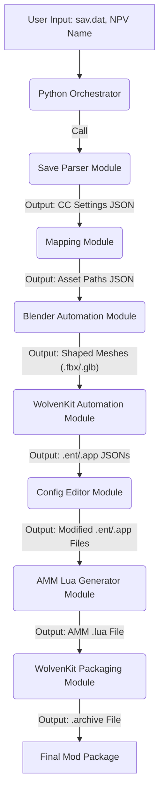

# Technical Implementation Specification: Cyberpunk 2077 NPV Automation

**Document Version:** 1.0
**Date:** May 22, 2026
**Author:** Manus AI

## 1. Introduction
This document details the technical implementation plan for automating the creation of Non-Playable V (NPV) characters in Cyberpunk 2077. It builds upon the Product Requirements Document (PRD) and the Feasibility Report, outlining the architecture, module design, and specific implementation steps for each component of the automated workflow.

## 2. System Architecture
The NPV automation system will be a CLI-based application, primarily written in Python, orchestrating various external tools and custom scripts. The architecture is modular, allowing for independent development and easier maintenance of each component.



## 3. Module Specifications

### 3.1. Python Orchestrator
*   **Purpose**: Main entry point, manages the overall workflow, calls other modules sequentially, and handles error reporting.
*   **Technology**: Python 3.x.
*   **Inputs**: Path to `sav.dat`, desired NPV name.
*   **Outputs**: Final mod package (archive and Lua file).
*   **Key Functions**:
    *   `main(save_path, npv_name)`: Orchestrates the entire process.
    *   `validate_inputs(save_path, npv_name)`: Ensures inputs are valid.
    *   `handle_errors(exception)`: Centralized error handling.

### 3.2. Save Parser Module
*   **Purpose**: Extract Character Creation (CC) settings from the user's `sav.dat` file.
*   **Technology**: Python 3.x, potentially leveraging existing CyberCAT libraries or custom binary parsing.
*   **Inputs**: Path to `sav.dat`.
*   **Outputs**: JSON file containing all relevant CC settings (e.g., `cc_settings.json`).
*   **Implementation Details**:
    *   Investigate existing Python libraries for Cyberpunk 2077 save file parsing (e.g., `fmwviormv/CyberpunkPythonHacks` [8]).
    *   If no suitable library exists, reverse-engineer the relevant sections of the `sav.dat` for CC data, focusing on the character appearance block.
    *   Map raw save data values to human-readable CC settings (e.g., `eye_shape_id: 2` -> `eyes: 
02`).

### 3.3. Mapping Module
*   **Purpose**: Translate CC settings into specific game asset paths and appearance names.
*   **Technology**: Python 3.x, JSON for lookup tables.
*   **Inputs**: `cc_settings.json`.
*   **Outputs**: `asset_paths.json` (contains paths to `.morphtarget`, `.mesh`, textures, material instances, etc.).
*   **Implementation Details**:
    *   Create a comprehensive JSON lookup table based on Redmodding Wiki's 
Cheat Sheets [7] and NoraLee's NPV Part Picker [3]. This table will map each CC option (e.g., 
eye shape 02) to its corresponding game asset path and appearance name. This module will then generate a structured JSON output containing all identified asset paths required for the NPV.

### 3.4. Blender Automation Module
*   **Purpose**: Automate the process of shaping 3D head meshes based on extracted CC settings.
*   **Technology**: Blender (CLI mode), Blender Python API (`bpy`).
*   **Inputs**: `asset_paths.json`, template `.blend` file containing base `.morphtarget` meshes.
*   **Outputs**: Shaped 3D meshes in a format compatible with WolvenKit (e.g., `.fbx`, `.glb`).
*   **Implementation Details**:
    *   Develop a Python script (`blender_script.py`) that can be executed by Blender in background mode (`blender --background --python blender_script.py`).
    *   The script will:
        *   Load the template `.blend` file.
        *   Import the necessary `.morphtarget` files identified in `asset_paths.json`.
        *   Access the Blender Python API (`bpy`) to manipulate shapekeys on the imported meshes, applying the values derived from the CC settings.
        *   Export the modified meshes to a designated output directory, ensuring correct naming conventions for subsequent WolvenKit processing.

### 3.5. WolvenKit Automation Module
*   **Purpose**: Manage WolvenKit project structure, extract and modify game configuration files (`.ent`, `.app`).
*   **Technology**: Python 3.x, `wolvenkit.cli` [4], JSON parsing libraries.
*   **Inputs**: `asset_paths.json`, raw shaped meshes from Blender, template `.ent` and `.app` files.
*   **Outputs**: Modified `.ent` and `.app` files ready for packaging.
*   **Implementation Details**:
    *   **Sub-module: Asset Extraction**: Use `wolvenkit.cli uncook` to extract any necessary base game assets (e.g., textures, material instances) that are not directly generated but need to be referenced or modified.
    *   **Sub-module: File Conversion**: Use `wolvenkit.cli convert -s` to convert template `.ent` and `.app` files into human-readable JSON format.
    *   **Sub-module: Config Editor Module (Integrated)**: A Python component within this module will:
        *   Parse the JSON representations of `.ent` and `.app` files.
        *   Programmatically update paths to the newly shaped meshes and other assets.
        *   Modify appearance definitions, component lists, and other relevant properties based on `asset_paths.json`.
        *   Ensure all internal references and unique identifiers are correctly updated to prevent conflicts.
    *   **Sub-module: File Re-conversion**: Use `wolvenkit.cli convert -d` to convert the modified JSON back into the binary `.ent` and `.app` formats.

### 3.6. AMM Lua Generator Module
*   **Purpose**: Generate the Lua script required by Appearance Menu Mod (AMM) to register the new NPV.
*   **Technology**: Python 3.x, string templating.
*   **Inputs**: NPV name, path to the root `.ent` file.
*   **Outputs**: `.lua` file (e.g., `my_npv_name.lua`).
*   **Implementation Details**:
    *   Create a template `.lua` file with placeholders for the NPV name, unique identifier, and the path to the root `.ent` file.
    *   A Python script will populate these placeholders with the provided inputs, ensuring the generated Lua script correctly registers the NPV with AMM.

### 3.7. WolvenKit Packaging Module
*   **Purpose**: Package all generated and modified files into a Cyberpunk 2077 `.archive` mod file.
*   **Technology**: `wolvenkit.cli` [4].
*   **Inputs**: All generated and modified assets, `.ent`, `.app`, and `.lua` files, organized in a WolvenKit project structure.
*   **Outputs**: Final `.archive` file.
*   **Implementation Details**:
    *   The Python orchestrator will invoke `wolvenkit.cli pack` command, pointing it to the root directory of the prepared WolvenKit project.
    *   The module will ensure the output `.archive` file is placed in a designated output directory, alongside the generated `.lua` file.

## 4. Data Structures

### 4.1. `cc_settings.json`
```json
{
  "gender": "female",
  "body_type": "average",
  "eyes": "02",
  "nose": "05",
  "mouth": "03",
  "jaw": "01",
  "ears": "04",
  "hair_style": "07",
  "hair_color": "red",
  "skin_tone": "light",
  "cyberware": {
    "head": "cyberware_01",
    "arms": "none"
  },
  "makeup": {
    "eyeliner": "01",
    "lipstick": "02"
  }
}
```

### 4.2. `asset_paths.json`
```json
{
  "head_mesh": "base\\characters\\head\\player_base_heads\\player_female_average\\h0_000_pwa_c__basehead.mesh",
  "head_morphtarget": "base\\characters\\head\\player_base_heads\\player_female_average\\.morphtarget",
  "eye_mesh": "base\\characters\\eyes\\eye_02.mesh",
  "hair_mesh": "base\\characters\\hair\\hair_07.mesh",
  "skin_material_instance": "base\\characters\\skin\\skin_light_01.mi",
  "cyberware_material_instance": "base\\cyberware\\head\\cyberware_01.mi",
  "ent_template": "templates\\npv_female_template.ent",
  "app_template": "templates\\npv_female_template.app"
}
```

## 5. Error Handling
*   Each module will implement robust error handling to catch exceptions during file operations, external tool execution, and data parsing.
*   Errors will be logged with sufficient detail to aid in debugging.
*   The Python Orchestrator will aggregate errors and provide user-friendly messages, indicating the step at which the failure occurred.

## 6. Testing Strategy
*   **Unit Tests**: Each module will have unit tests to verify its individual functionality (e.g., save parsing accuracy, asset path generation, Blender script execution).
*   **Integration Tests**: End-to-end tests will be conducted to ensure seamless data flow and correct execution across all modules.
*   **Validation**: Generated NPV mods will be manually tested in Cyberpunk 2077 to confirm correct appearance and functionality.

## 7. Deployment
The automated tool will be distributed as a Python package, installable via `pip`, with all necessary dependencies (Blender, WolvenKit CLI) documented for manual installation.

## 8. Future Enhancements
*   Develop a user-friendly GUI for easier interaction.
*   Integrate direct in-game appearance extraction via CET Lua scripting.
*   Expand support for custom modded assets and clothing.
*   Implement version control for asset mappings to adapt to game updates.

## 9. References
[1] Redmodding Wiki. "NPV - V as custom NPC." https://wiki.redmodding.org/cyberpunk-2077-modding/modding-guides/npcs/npv-v-as-custom-npc
[2] Redmodding Wiki. "NPV: Creating a custom NPC." https://wiki.redmodding.org/cyberpunk-2077-modding/modding-guides/npcs/npv-v-as-custom-npc/npv-creating-a-custom-npc
[3] NoraLee. "NPV - Tutorial - Part 1." https://noraleedoes.neocities.org/npv/tut/pg02
[4] Redmodding Wiki. "Wolvenkit.CLI: Command List." https://wiki.redmodding.org/wolvenkit/wolvenkit-cli/usage/command-list
[5] Nexus Mods. "Cyber Engine Tweaks." https://www.nexusmods.com/cyberpunk2077/mods/107
[6] Redmodding Wiki. "Savegame Editor: CyberCAT." https://wiki.redmodding.org/cyberpunk-2077-modding/for-mod-creators-theory/modding-tools/savegame-editor-cybercat
[7] Redmodding Wiki. "Cheat Sheet: Head." https://wiki.redmodding.org/cyberpunk-2077-modding/for-mod-creators-theory/references-lists-and-overviews/cheat-sheet-head
[8] GitHub. "fmwviormv/CyberpunkPythonHacks." https://github.com/fmwviormv/CyberpunkPythonHacks
